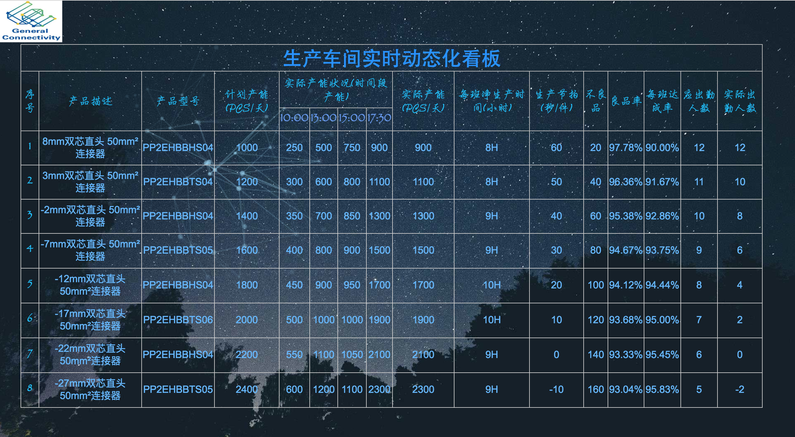

# xlsx over web

[](http://github.com/hhyo/archery/blob/master/LICENSE)
[](https://www.python.org/downloads/release/python-375/)

## 功能简介

基于Django开发的excel表格页面化展示系统，自动将本地xlsx文件导入到Django自带的sqlite3数据库，显示到前端页面

## 效果图



## 部署

### 部署python3

google即可。

### 部署虚拟环境

google即可。

### 克隆代码

git clone https://github.com/sunnywalden/xlsx_over_web.git --depth 1

### 安装依赖

pip install -r requirements.txt

### 数据库迁移

```
python manage.py makemigrations

python manage.py migrate

```

### 运行项目

```
python manage.py runserver

```

